# DSO101 Assignment III - CI/CD Pipeline with GitHub Actions

**Student Name:** UgayNobu  
**Student ID:** 02240369  
**Course:** DSO101 - Continuous Integration and Continuous Deployment  

---

## Objective

In this assignment, a GitHub Actions workflow was configured to automate:
1. Building Docker containers for the todo-app (backend and frontend).
2. Pushing the containers to DockerHub.
3. Deploying the containers on Render.com.

---

## Tools & Technologies

| Tool | Purpose |
|------|---------|
| GitHub | Hosting source code |
| GitHub Actions | CI/CD automation |
| Docker | Containerization |
| DockerHub | Container registry |
| Render.com | Cloud deployment |
| Node.js & npm | Backend runtime & package management |
| Next.js | Frontend framework |
| PostgreSQL | Database |

---

## Task 1: Verify GitHub Repository Setup

### Overview
Verified that the GitHub repository was public and contained the required `package.json` files with relevant scripts for both backend and frontend. The todo-app from Assignment 1 was used with `backend/` and `frontend/` folders each containing a `Dockerfile`.

---

## Task 2: Verify Dockerfiles

### Overview
Both backend and frontend contained Dockerfiles. The frontend Dockerfile was updated to hardcode the `NEXT_PUBLIC_API_URL` environment variable so it gets baked into the Next.js build at image build time.

### Backend Dockerfile
```dockerfile
FROM node:18-alpine
WORKDIR /app
COPY package*.json ./
RUN npm install
RUN npm install pg
COPY . .
EXPOSE 5000
CMD ["npm", "start"]
```

### Frontend Dockerfile
```dockerfile
FROM node:18-alpine
WORKDIR /app
COPY package*.json ./
RUN npm install
COPY . .
ENV NEXT_PUBLIC_API_URL=https://be-todo-a3.onrender.com
RUN npm run build
EXPOSE 3000
CMD ["npm", "start"]
```

### Step 1: Build and Push Backend Image to DockerHub

Built and pushed the backend Docker image manually so Render could pull it for initial setup:
```bash
cd todo-app/backend
docker buildx build --platform linux/amd64 \
  -t ugaynobu/be-todo:latest \
  --push --provenance=false --sbom=false .
```

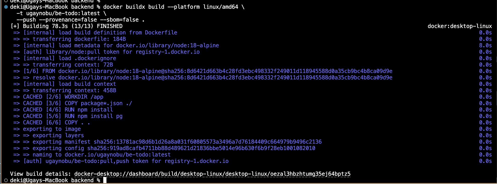

---

### Step 2: Push Frontend Image to DockerHub

Tagged the existing frontend image and pushed it as `:latest`:
```bash
docker tag ugaynobu/fe-todo:02240369 ugaynobu/fe-todo:latest
docker push ugaynobu/fe-todo:latest
```

Both images confirmed on DockerHub:

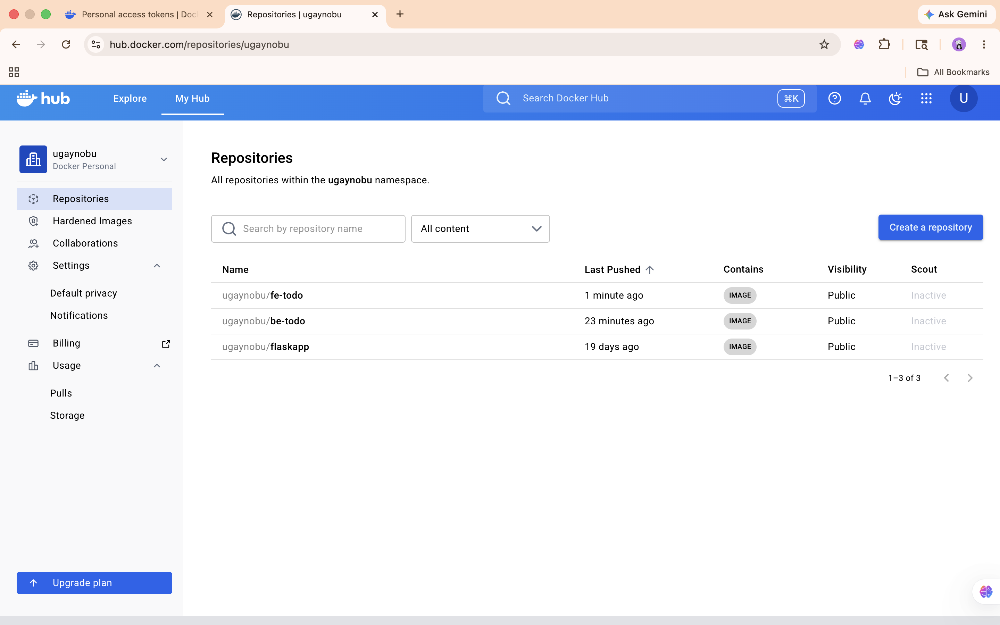

---

## Task 3: Create GitHub Actions Workflow

### Overview
Created `.github/workflows/deploy.yml` to automate building and pushing Docker images to DockerHub, and triggering a Render redeployment via webhook on every push to `main`.

### Step 1: Create deploy.yml

Created `.github/workflows/deploy.yml` with the following content:

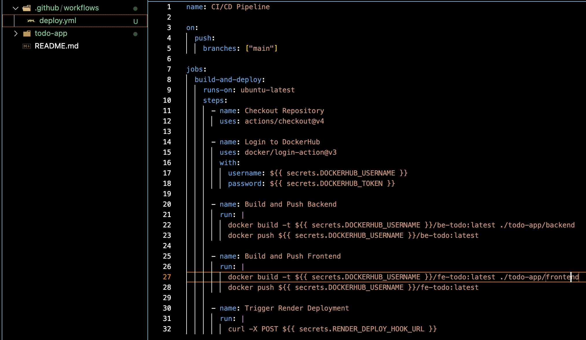

```yaml
name: CI/CD Pipeline

on:
  push:
    branches: ["main"]

jobs:
  build-and-deploy:
    runs-on: ubuntu-latest
    steps:
      - name: Checkout Repository
        uses: actions/checkout@v4

      - name: Login to DockerHub
        uses: docker/login-action@v3
        with:
          username: ${{ secrets.DOCKERHUB_USERNAME }}
          password: ${{ secrets.DOCKERHUB_TOKEN }}

      - name: Set up Docker Buildx
        uses: docker/setup-buildx-action@v3

      - name: Build and Push Backend
        uses: docker/build-push-action@v5
        with:
          context: ./todo-app/backend
          push: true
          tags: ugaynobu/be-todo:latest

      - name: Build and Push Frontend
        uses: docker/build-push-action@v5
        with:
          context: ./todo-app/frontend
          push: true
          tags: ugaynobu/fe-todo:latest
          build-args: |
            NEXT_PUBLIC_API_URL=https://be-todo-a3.onrender.com

      - name: Trigger Render Deployment
        run: |
          curl -X POST ${{ secrets.RENDER_DEPLOY_HOOK_URL }}
```

---

### Step 2: Add GitHub Secrets

Added the following secrets to the GitHub repository under Settings → Secrets and variables → Actions:

- `DOCKERHUB_USERNAME` — DockerHub username
- `DOCKERHUB_TOKEN` — DockerHub personal access token (Read & Write, Never expires)
- `RENDER_DEPLOY_HOOK_URL` — Render deploy webhook URL for be-todo-A3

A new DockerHub personal access token was generated with Read & Write permissions:

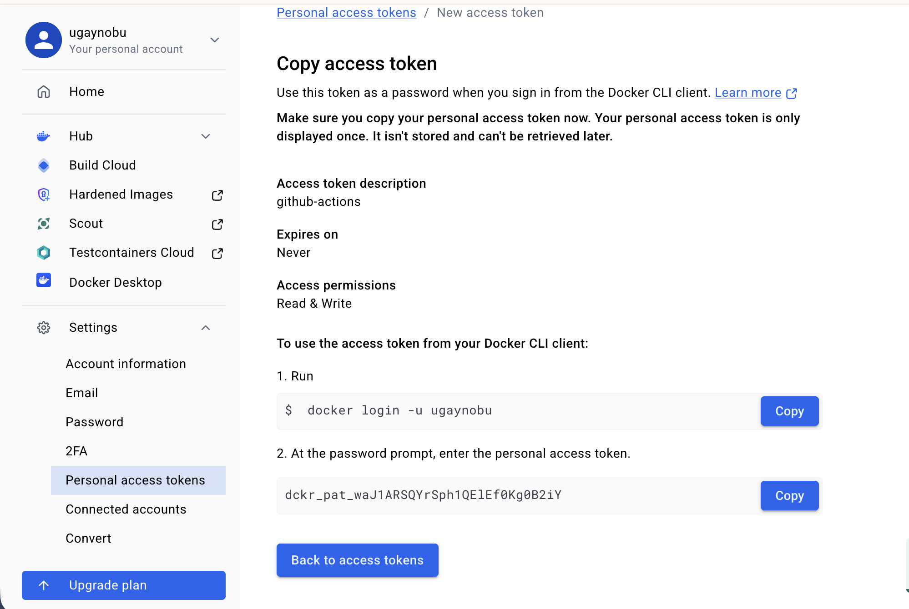

All three secrets confirmed in GitHub:

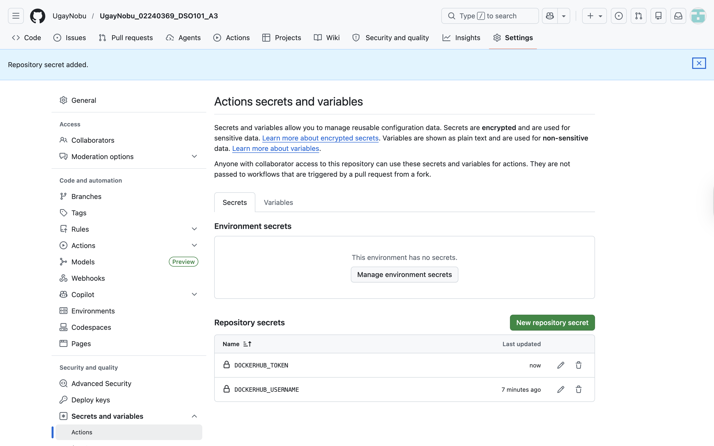

---

### Step 3: Push to GitHub and Trigger Workflow

Pushed the code to GitHub to trigger the GitHub Actions workflow:
```bash
git add .
git commit -m "Add GitHub Actions CI/CD pipeline with deploy workflow"
git push origin main
```

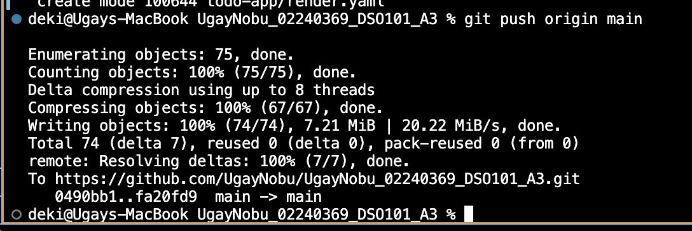

GitHub Actions workflow ran successfully:

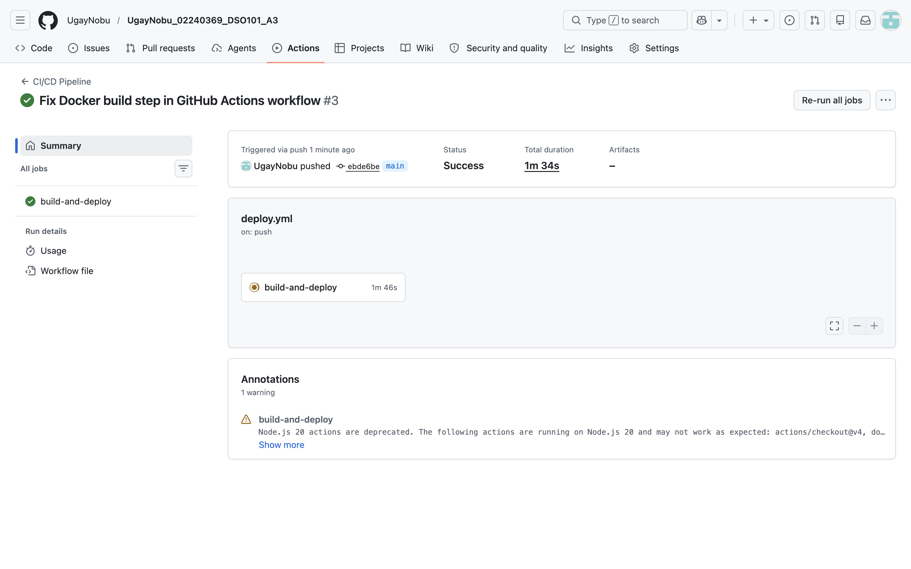

---

## Task 4: Deploy on Render.com

### Overview
Created two new web services on Render.com (`be-todo-A3` and `fe-todo-A3`) using the existing Docker images from DockerHub. A new PostgreSQL database (`todo-db-a3`) was also created since the previous one had expired.

### Step 1: Create Backend Service on Render

1. Clicked **New +** → **Web Service** → **Existing Image**
2. Entered image: `ugaynobu/be-todo:latest`
3. Set name: `be-todo-A3`, Region: Singapore, Plan: Free

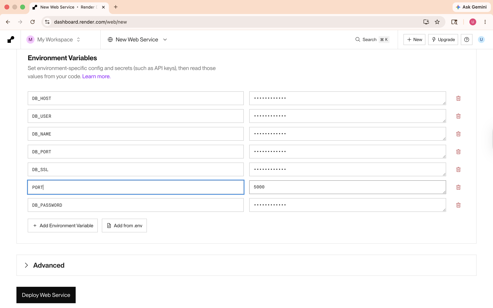

4. Added environment variables:

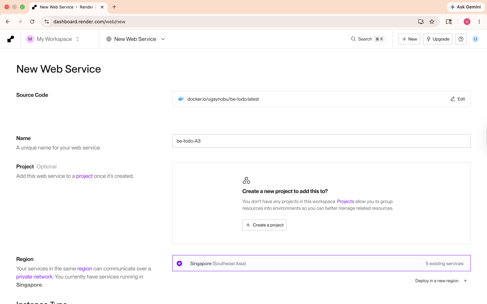

5. Clicked **Deploy Web Service**

Backend deployed successfully:

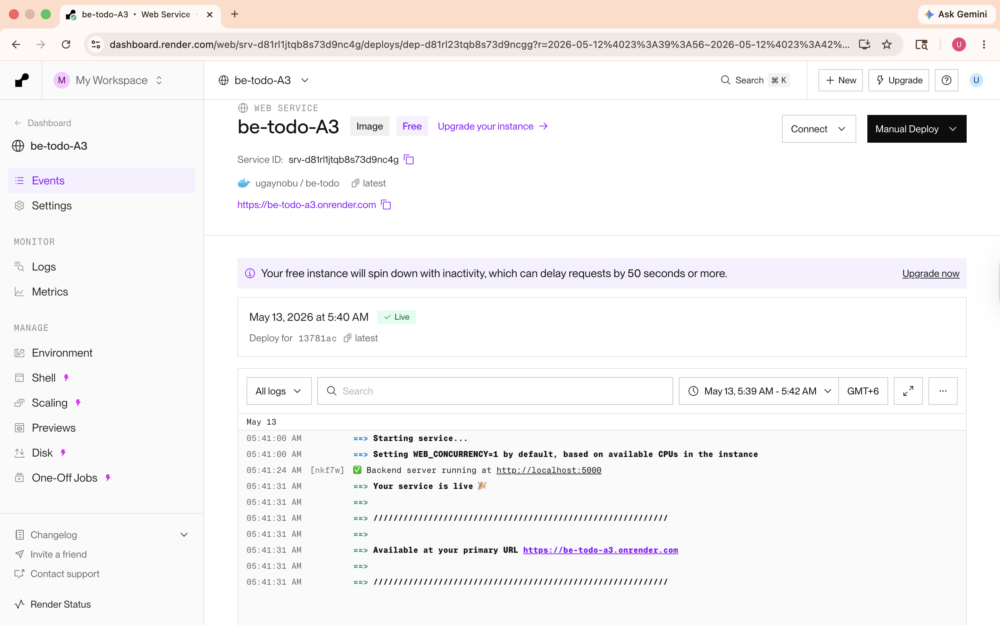

---

### Step 2: Get Render Deploy Hook URL

Navigated to be-todo-A3 → Settings → Deploy Hook and copied the webhook URL. This was added as the `RENDER_DEPLOY_HOOK_URL` GitHub secret so GitHub Actions can trigger redeployments automatically.

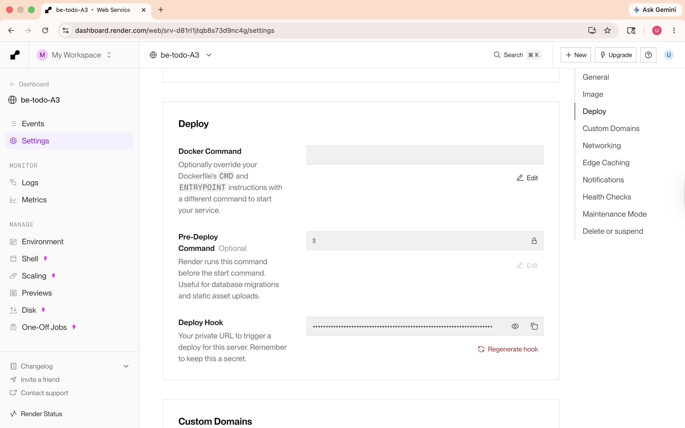

---

### Step 3: Confirm All GitHub Secrets

After adding the Render deploy hook, all 3 secrets were confirmed:

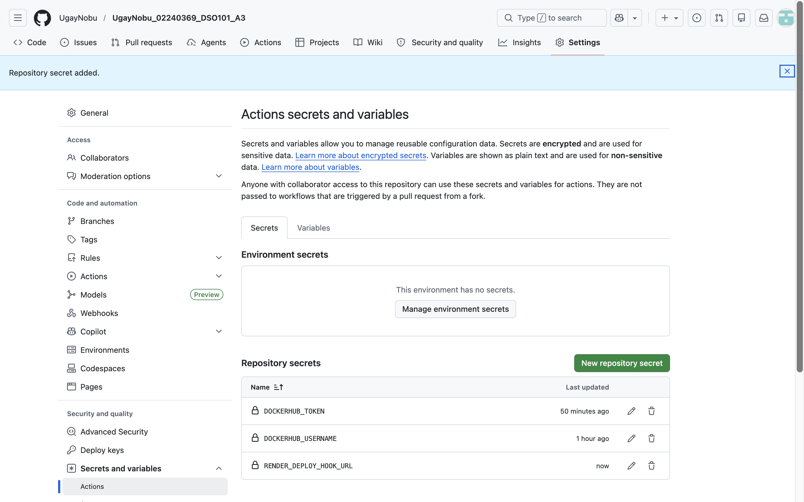

---

### Step 4: Create Frontend Service on Render

1. Clicked **New +** → **Web Service** → **Existing Image**
2. Entered image: `ugaynobu/fe-todo:latest`
3. Set name: `fe-todo-A3`, Region: Singapore, Plan: Free
4. Added environment variable: `NEXT_PUBLIC_API_URL=https://be-todo-a3.onrender.com`

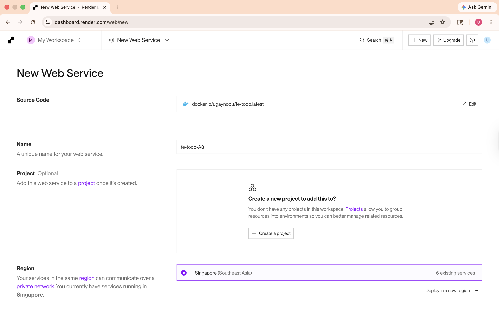

Frontend deployed successfully:

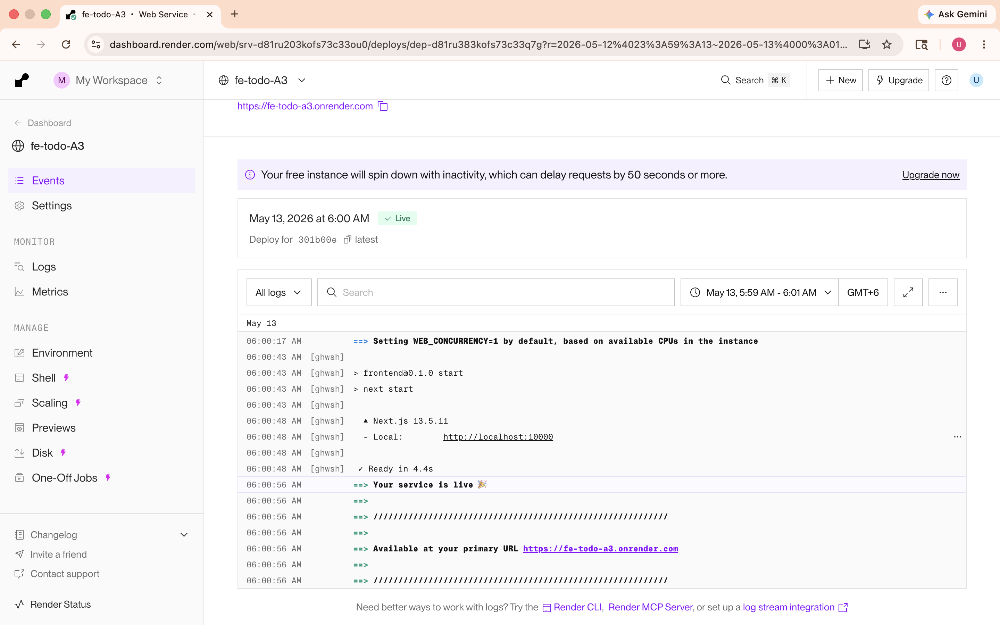

---

### Step 5: Create New PostgreSQL Database

The previous database had expired (Render free tier expires after 90 days). A new PostgreSQL database `todo-db-a3` was created and the backend environment variables were updated with the new credentials. The tasks table was created manually using `psql`:
```sql
CREATE TABLE IF NOT EXISTS tasks (
  id SERIAL PRIMARY KEY,
  title VARCHAR(255) NOT NULL,
  description TEXT,
  completed BOOLEAN DEFAULT false,
  created_at TIMESTAMP DEFAULT CURRENT_TIMESTAMP
);
```

---

### Step 6: Verify Deployment

The full-stack application is working correctly at `https://fe-todo-a3.onrender.com`:

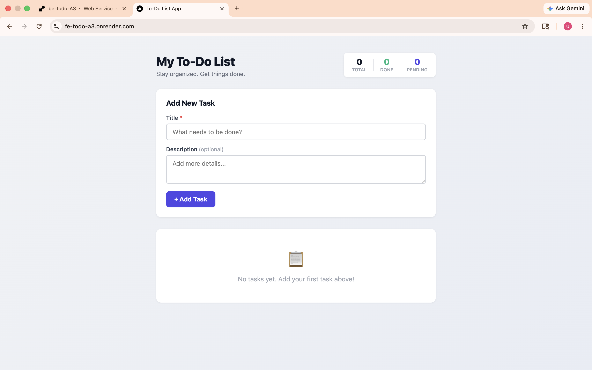

A test task was added to confirm end-to-end functionality:

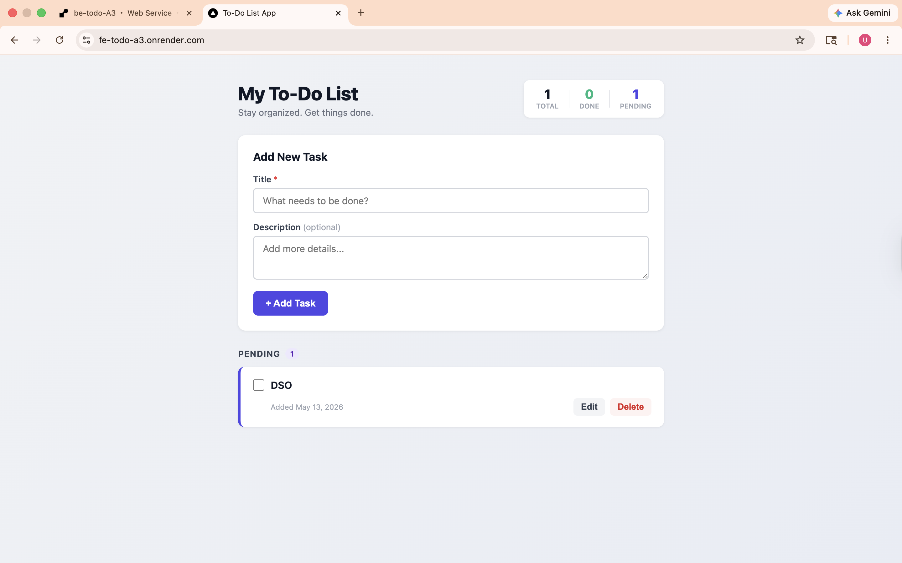

---


## Learning Outcomes

1. Learned how to create and configure a GitHub Actions workflow (`.github/workflows/deploy.yml`) to automate CI/CD.
2. Understood how to use GitHub Secrets to securely store credentials like DockerHub tokens and Render webhook URLs.
3. Learned how to use `docker/build-push-action@v5` with Buildx for cross-platform Docker image builds in GitHub Actions.
4. Understood why `NEXT_PUBLIC_API_URL` must be baked into the Next.js build at image build time, not at runtime.
5. Learned how to trigger Render redeployments automatically via webhook from GitHub Actions.
6. Gained experience debugging CI/CD pipeline failures by reading GitHub Actions logs.

---

## Results

| Task | Status |
|------|--------|
| GitHub repo with Dockerfile | ✅ Complete |
| `.github/workflows/deploy.yml` created | ✅ Complete |
| GitHub Secrets configured | ✅ Complete |
| GitHub Actions pipeline successful | ✅ Complete |
| DockerHub images pushed automatically | ✅ Complete |
| Backend deployed on Render (be-todo-A3) | ✅ Complete |
| Frontend deployed on Render (fe-todo-A3) | ✅ Complete |
| Full-stack app working end-to-end | ✅ Complete |

---

## Live URLs

| Service | URL |
|---------|-----|
| Frontend | `https://fe-todo-a3.onrender.com` |
| Backend | `https://be-todo-a3.onrender.com` |
| GitHub Repository | `https://github.com/UgayNobu/UgayNobu_02240369_DSO101_A3` |

---

## References

- [GitHub Actions Documentation](https://docs.github.com/en/actions)
- [Docker Build Push Action](https://github.com/docker/build-push-action)
- [Render Deploy Hooks](https://render.com/docs/deploy-hooks)
- [DockerHub Personal Access Tokens](https://docs.docker.com/security/for-developers/access-tokens/)
- [Next.js Environment Variables](https://nextjs.org/docs/pages/building-your-application/configuring/environment-variables)